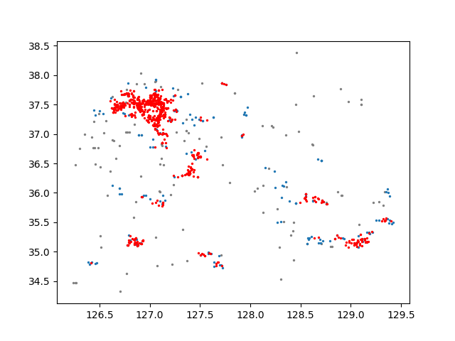

# (2022 Fall) Theory of Computation Project
2022-29307 김대현, 2022-23583 최유진

## Instruction

### Preliminaries

- `matplotlib` and `numpy` library is needed. Install these packages using command below:
```
pip install matplotlib
pip install numpy
```

- Input file is also needed. Our DenForest processes 2 dimesional spatial data and it should be in csv format.
```
126.655185 , 37.57862
126.87673 , 35.130691
...
126.84179 , 37.161333
127.462785 , 36.62359
```

### How to Run
You can run the program using command below.
```
python3.8 ./main.py <input_file_path> <tau_value> <eps_value> <window_size> <stride_size>
```
ex)python3.8 ./main.py ../dataset/input.csv 5 0.1 1000 20

### Result
Result is generated using matplotlib's pyplot modules. You can check the clustering result from figure named `result.png` in your working directory.
Below example is the result of `python3.8 ./main.py ../dataset/simple.csv 5 0.1 500 10`


## Implemenation Details

### Data Structures
- *ncoreTable* stores nostalgic cores having core-expiration time as key and node as value
- *nodeTable* stores datapoints in the current window having coordinates (x, y) as key and node as value
- *edgeTable* stores all the edges in the DenTree having node n as key and (node m, edge weight) as value

### Source Codes
- splaytree.py
  - defines the functions used for Splay Tree which are *isRoot, Rotate, and Splay*
- lctree.py
  - Link Cut tree's Node and Edge structure are defined
  - defines the functions used for Link Cut Tree which are *FindRoot, Connected, LCA, Access, Link, Cut, and FindMinE*
- denforest.py
  - defines *Connect* function used in DenForest
  - defines *Result* fuction that generates the clustering result
- main.py
  - executes insert and delete using arguments (tau, eps, window size and stride size)
  
- More details are described within the comments in the source codes

### Reference
[DenForest: Enabling Fast Deletion in Incremental Density-Based Clustering over Sliding Windows](https://dl.acm.org/doi/pdf/10.1145/3514221.3517833?casa_token=DkJOEtONPWkAAAAA:GbVjeghzGqQCMVC5e9iN5pulJtkBGkoMN52qxyGQOAnY8nLwyVUtzCy3ue-mTE2cqDr3EDfbdz0)
